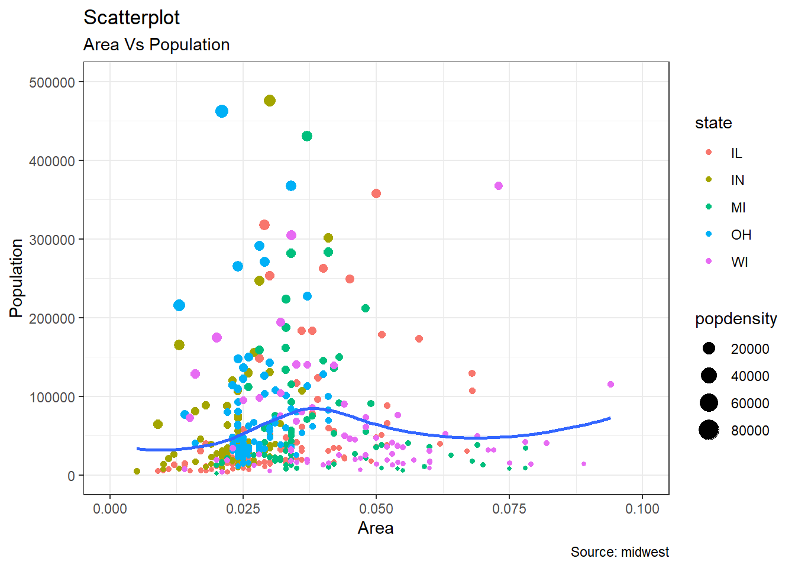

# Intro {-}

Template based on [bookdown](https://bookdown.org/yihui/bookdown/).

Refer to a [sub section](#sub-analysis). 
Citing an article [@article]. 
Refer to section [Analysis].

# Input {-}

Loading libraries:

```r
library(DT)
library(ggplot2)
library(xfun)
```

# Analysis {-}

`Vestibulum` imperdiet ^[In eget eros sit amet leo feugiat consequat], ex vel sodales facilisis, nibh tellus imperdiet massa, sit amet scelerisque orci velit vel tellus. Ut consequat justo tincidunt porttitor varius. Suspendisse erat ipsum, feugiat vitae rhoncus non, molestie ac purus. Morbi aliquet, elit eget blandit suscipit, est lacus facilisis turpis, nec fermentum nunc felis et lorem.

:::{#Table1}
A nice table example:
:::


```r
DT::datatable(mtcars, options = list(pageLength = 3))
```

```{=html}
<div id="htmlwidget-d49c251b7488f29a73bd" style="width:100%;height:auto;" class="datatables html-widget"></div>
<script type="application/json" data-for="htmlwidget-d49c251b7488f29a73bd">{"x":{"filter":"none","data":[["Mazda RX4","Mazda RX4 Wag","Datsun 710","Hornet 4 Drive","Hornet Sportabout","Valiant","Duster 360","Merc 240D","Merc 230","Merc 280","Merc 280C","Merc 450SE","Merc 450SL","Merc 450SLC","Cadillac Fleetwood","Lincoln Continental","Chrysler Imperial","Fiat 128","Honda Civic","Toyota Corolla","Toyota Corona","Dodge Challenger","AMC Javelin","Camaro Z28","Pontiac Firebird","Fiat X1-9","Porsche 914-2","Lotus Europa","Ford Pantera L","Ferrari Dino","Maserati Bora","Volvo 142E"],[21,21,22.8,21.4,18.7,18.1,14.3,24.4,22.8,19.2,17.8,16.4,17.3,15.2,10.4,10.4,14.7,32.4,30.4,33.9,21.5,15.5,15.2,13.3,19.2,27.3,26,30.4,15.8,19.7,15,21.4],[6,6,4,6,8,6,8,4,4,6,6,8,8,8,8,8,8,4,4,4,4,8,8,8,8,4,4,4,8,6,8,4],[160,160,108,258,360,225,360,146.7,140.8,167.6,167.6,275.8,275.8,275.8,472,460,440,78.7,75.7,71.1,120.1,318,304,350,400,79,120.3,95.1,351,145,301,121],[110,110,93,110,175,105,245,62,95,123,123,180,180,180,205,215,230,66,52,65,97,150,150,245,175,66,91,113,264,175,335,109],[3.9,3.9,3.85,3.08,3.15,2.76,3.21,3.69,3.92,3.92,3.92,3.07,3.07,3.07,2.93,3,3.23,4.08,4.93,4.22,3.7,2.76,3.15,3.73,3.08,4.08,4.43,3.77,4.22,3.62,3.54,4.11],[2.62,2.875,2.32,3.215,3.44,3.46,3.57,3.19,3.15,3.44,3.44,4.07,3.73,3.78,5.25,5.424,5.345,2.2,1.615,1.835,2.465,3.52,3.435,3.84,3.845,1.935,2.14,1.513,3.17,2.77,3.57,2.78],[16.46,17.02,18.61,19.44,17.02,20.22,15.84,20,22.9,18.3,18.9,17.4,17.6,18,17.98,17.82,17.42,19.47,18.52,19.9,20.01,16.87,17.3,15.41,17.05,18.9,16.7,16.9,14.5,15.5,14.6,18.6],[0,0,1,1,0,1,0,1,1,1,1,0,0,0,0,0,0,1,1,1,1,0,0,0,0,1,0,1,0,0,0,1],[1,1,1,0,0,0,0,0,0,0,0,0,0,0,0,0,0,1,1,1,0,0,0,0,0,1,1,1,1,1,1,1],[4,4,4,3,3,3,3,4,4,4,4,3,3,3,3,3,3,4,4,4,3,3,3,3,3,4,5,5,5,5,5,4],[4,4,1,1,2,1,4,2,2,4,4,3,3,3,4,4,4,1,2,1,1,2,2,4,2,1,2,2,4,6,8,2]],"container":"<table class=\"display\">\n  <thead>\n    <tr>\n      <th> <\/th>\n      <th>mpg<\/th>\n      <th>cyl<\/th>\n      <th>disp<\/th>\n      <th>hp<\/th>\n      <th>drat<\/th>\n      <th>wt<\/th>\n      <th>qsec<\/th>\n      <th>vs<\/th>\n      <th>am<\/th>\n      <th>gear<\/th>\n      <th>carb<\/th>\n    <\/tr>\n  <\/thead>\n<\/table>","options":{"pageLength":3,"columnDefs":[{"className":"dt-right","targets":[1,2,3,4,5,6,7,8,9,10,11]},{"orderable":false,"targets":0}],"order":[],"autoWidth":false,"orderClasses":false,"lengthMenu":[3,10,25,50,100]}},"evals":[],"jsHooks":[]}</script>
```

## Sub analysis {-}

> Suspendisse potenti

We can have math formulas inline like this: $E=mc^2$ or make them span an entire line like this:
\begin{equation} 
  f=\frac{a}{b+c}
  (\#eq:eq1)
\end{equation}

**Create a horizontal line** using [markdown syntax](https://commonmark.org/help/):

---

Cras pulvinar ligula ac nisi porttitor, volutpat congue orci tincidunt. Pellentesque non mi congue, porta enim eget, venenatis sem. Integer suscipit vulputate tellus, eget commodo dolor gravida vel. Suspendisse gravida gravida ligula, in interdum sapien molestie ut.

### Yet another analysis {-}

:::{.blue-box}
In ut vehicula risus. 
Refer to the [table](#Table1) above!
:::


```r
options(scipen=999)  # turn-off scientific notation like 1e+48
theme_set(theme_bw())  # pre-set the bw theme.
data("midwest", package = "ggplot2")
# midwest <- read.csv("http://goo.gl/G1K41K")  # bkup data source

# Scatterplot
gg = ggplot(midwest, aes(x=area, y=poptotal)) + 
  geom_point(aes(col=state, size=popdensity)) + 
  geom_smooth(method="loess", se=F) + 
  xlim(c(0, 0.1)) + 
  ylim(c(0, 500000)) + 
  labs(subtitle="Area Vs Population", 
       y="Population", 
       x="Area", 
       title="Scatterplot", 
       caption = "Source: midwest")

plot(gg)
```

```
## `geom_smooth()` using formula 'y ~ x'
```

<div class="figure" style="text-align: center">

<p class="caption">(\#fig:example-plot)A nice figure example</p>
</div>

Remember equation \@ref(eq:eq1)!

# Conclusion {-}

:::{#box1 .green-box}
Wrapping it up!
:::

:::{#caution-text .caution}
- *Cras tincidunt* felis venenatis pretium iaculis ^[Nullam quis sem nunc]. 
- Curabitur in **tortor at tellus** fermentum elementum vel quis sem.
- That sums it up!
:::

:::{#warning-text .warning}
Be careful, be gentle, be brave! 
And remember the above [box!](#box1)
:::

:::{#tip-text .tip}
A tip!
:::

:::{#note-text .note}
A note!
:::

:::{#important-text .important}
I have something **important** to say here!
:::

:::{.orange-box}
An orange box!!! Remember figure (\@ref(fig:example-plot))!
:::

# R session info {-}


```{.r .fold-show}
xfun::session_info()
```

```
R version 4.0.5 (2021-03-31)
Platform: x86_64-w64-mingw32/x64 (64-bit)
Running under: Windows 10 x64 (build 19043)

Locale:
  LC_COLLATE=English_United Kingdom.1252 
  LC_CTYPE=English_United Kingdom.1252   
  LC_MONETARY=English_United Kingdom.1252
  LC_NUMERIC=C                           
  LC_TIME=English_United Kingdom.1252    

Package version:
  assertthat_0.2.1   base64enc_0.1.3    bookdown_0.22      bslib_0.2.5.1     
  cli_2.5.0          colorspace_2.0-1   compiler_4.0.5     crayon_1.4.1      
  crosstalk_1.1.1    DBI_1.1.1          digest_0.6.27      dplyr_1.0.5       
  DT_0.18            ellipsis_0.3.2     evaluate_0.14      fansi_0.4.2       
  farver_2.1.0       fs_1.5.0           generics_0.1.0     ggplot2_3.3.4     
  glue_1.4.2         graphics_4.0.5     grDevices_4.0.5    grid_4.0.5        
  gtable_0.3.0       highr_0.9          htmltools_0.5.1.1  htmlwidgets_1.5.3 
  isoband_0.2.4      jquerylib_0.1.4    jsonlite_1.7.2     knitr_1.33        
  labeling_0.4.2     later_1.2.0        lattice_0.20-41    lazyeval_0.2.2    
  lifecycle_1.0.0    magrittr_2.0.1     markdown_1.1       MASS_7.3.53.1     
  Matrix_1.3-2       methods_4.0.5      mgcv_1.8-34        mime_0.10         
  munsell_0.5.0      nlme_3.1-152       pillar_1.6.0       pkgconfig_2.0.3   
  promises_1.2.0.1   purrr_0.3.4        R6_2.5.0           rappdirs_0.3.3    
  RColorBrewer_1.1.2 Rcpp_1.0.6         rlang_0.4.11       rmarkdown_2.8     
  sass_0.4.0         scales_1.1.1       splines_4.0.5      stats_4.0.5       
  stringi_1.5.3      stringr_1.4.0      tibble_3.1.1       tidyselect_1.1.1  
  tinytex_0.31       tools_4.0.5        utf8_1.2.1         utils_4.0.5       
  vctrs_0.3.8        viridisLite_0.4.0  withr_2.4.2        xfun_0.22         
  yaml_2.2.1        
```

# References {-}
